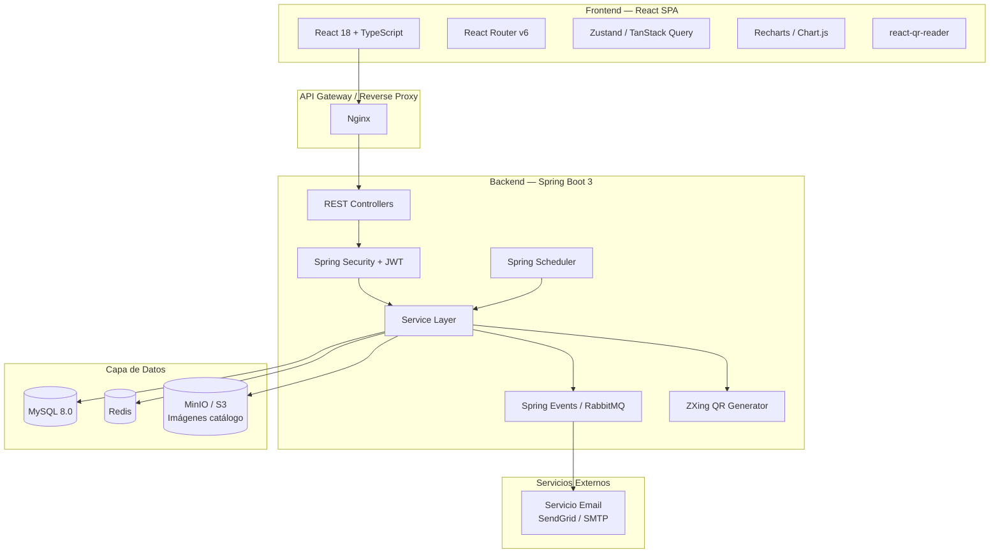
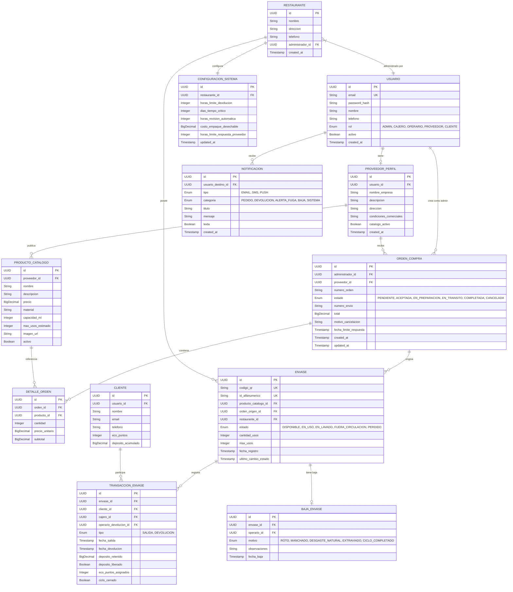

# Sistema de Economía Circular — Plan de Implementación

## Plataforma de Trazabilidad y Gestión de Envases Reutilizables

> [!NOTE]
> Este plan cubre el **Módulo 1: Configuración y Registro (Base del Sistema)** que incluye 20 casos de uso organizados en 3 dominios funcionales: Gestión de Proveedores/Pedidos, Trazabilidad de Envases y Reportes/Alertas.

---

## 1. Arquitectura de Alto Nivel



---

## 2. Modelo de Dominio



---

## 3. Stack Tecnológico Detallado

### Backend (Java Spring Boot)

| Componente | Tecnología | Justificación |
|---|---|---|
| **Framework** | Spring Boot 3.3+ | Ecosistema maduro, DI, auto-configuración |
| **Seguridad** | Spring Security + JWT (jjwt) | Autenticación stateless, roles RBAC |
| **Persistencia** | Spring Data JPA + Hibernate | ORM robusto, queries dinámicas |
| **Base de datos** | MySQL 8.0+ | Amplia adopción, rendimiento, compatibilidad |
| **Caché** | Redis + Spring Cache | Sesiones, caché de catálogos, rate-limiting |
| **Notificaciones** | Email (JavaMailSender + SendGrid) | Solo email para MVP |
| **Mensajería** | RabbitMQ + Spring AMQP | Notificaciones asíncronas, eventos desacoplados |
| **Scheduler** | Spring Scheduler (`@Scheduled`) | Jobs de alertas de fuga (CU-13) |
| **QR** | ZXing (Zebra Crossing) | Generación de códigos QR (CU-04) |
| **Archivos** | MinIO (S3-compatible) | Almacenamiento de imágenes de catálogo |
| **Reportes** | Apache POI + iText | Exportación PDF/Excel (CU-12) |
| **Validación** | Bean Validation (Jakarta) | Validación declarativa en DTOs |
| **Documentación** | SpringDoc OpenAPI 3 | Swagger UI automático |
| **Migraciones** | Flyway | Versionado de esquema DB |
| **Testing** | JUnit 5, Mockito, Testcontainers | Tests unitarios, integración con DB real |

### Frontend (React)

| Componente | Tecnología | Justificación |
|---|---|---|
| **Framework** | React 18 + TypeScript | Tipado fuerte, componentes reutilizables |
| **Build** | Vite 5 | Build rápido, HMR instantáneo |
| **Routing** | React Router v6 | Rutas protegidas por rol |
| **Estado servidor** | TanStack Query (React Query) | Caché, refetch, optimistic updates |
| **Estado local** | Zustand | Store ligero para UI state |
| **HTTP** | Axios | Interceptores JWT, manejo errores |
| **UI Components** | Material UI (MUI) v5 | Componentes enterprise-ready, design system robusto |
| **Formularios** | React Hook Form + Zod | Validación performante |
| **Gráficos** | Recharts | Dashboard de métricas (CU-12) |
| **QR Scanner** | html5-qrcode | Escaneo QR desde cámara (CU-09, CU-10) |
| **Tablas** | TanStack Table | Tablas con filtros, paginación, sort |
| **Notificaciones** | React Toastify | Feedback visual al usuario |

---

## 4. Estructura del Proyecto

### Backend — Estructura de paquetes

```
economia-circular-api/
├── src/main/java/com/economiancircular/
│   ├── EconomiaCircularApplication.java
│   ├── config/
│   │   ├── SecurityConfig.java
│   │   ├── JwtConfig.java
│   │   ├── RabbitMQConfig.java
│   │   ├── RedisConfig.java
│   │   ├── CorsConfig.java
│   │   └── SwaggerConfig.java
│   ├── common/
│   │   ├── exception/
│   │   │   ├── GlobalExceptionHandler.java
│   │   │   ├── ResourceNotFoundException.java
│   │   │   └── BusinessRuleException.java
│   │   ├── dto/
│   │   │   ├── ApiResponse.java
│   │   │   └── PageResponse.java
│   │   └── util/
│   │       └── QRCodeGenerator.java
│   │
│   ├── auth/
│   │   ├── controller/AuthController.java
│   │   ├── service/AuthService.java
│   │   ├── dto/ (LoginRequest, RegisterRequest, TokenResponse)
│   │   └── jwt/JwtTokenProvider.java
│   │
│   ├── usuario/
│   │   ├── controller/UsuarioController.java
│   │   ├── service/UsuarioService.java
│   │   ├── repository/UsuarioRepository.java
│   │   ├── entity/Usuario.java
│   │   └── dto/
│   │
│   ├── proveedor/
│   │   ├── controller/ProveedorController.java
│   │   ├── service/ProveedorService.java
│   │   ├── repository/
│   │   │   ├── ProveedorPerfilRepository.java
│   │   │   └── ProductoCatalogoRepository.java
│   │   ├── entity/
│   │   │   ├── ProveedorPerfil.java
│   │   │   └── ProductoCatalogo.java
│   │   └── dto/
│   │
│   ├── orden/
│   │   ├── controller/OrdenCompraController.java
│   │   ├── service/OrdenCompraService.java
│   │   ├── repository/
│   │   │   ├── OrdenCompraRepository.java
│   │   │   └── DetalleOrdenRepository.java
│   │   ├── entity/
│   │   │   ├── OrdenCompra.java
│   │   │   └── DetalleOrden.java
│   │   └── dto/
│   │
│   ├── envase/
│   │   ├── controller/EnvaseController.java
│   │   ├── service/
│   │   │   ├── EnvaseService.java
│   │   │   ├── TransaccionService.java
│   │   │   └── BajaEnvaseService.java
│   │   ├── repository/
│   │   │   ├── EnvaseRepository.java
│   │   │   ├── TransaccionEnvaseRepository.java
│   │   │   └── BajaEnvaseRepository.java
│   │   ├── entity/
│   │   │   ├── Envase.java
│   │   │   ├── TransaccionEnvase.java
│   │   │   └── BajaEnvase.java
│   │   └── dto/
│   │
│   ├── inventario/
│   │   ├── controller/InventarioController.java
│   │   ├── service/InventarioService.java
│   │   └── dto/
│   │
│   ├── notificacion/
│   │   ├── service/NotificacionService.java
│   │   ├── listener/NotificacionEventListener.java
│   │   ├── repository/NotificacionRepository.java
│   │   ├── entity/Notificacion.java
│   │   └── event/
│   │       ├── OrdenEvent.java
│   │       ├── DevolucionEvent.java
│   │       └── AlertaFugaEvent.java
│   │
│   ├── scheduler/
│   │   └── AlertaFugaScheduler.java
│   │
│   ├── dashboard/
│   │   ├── controller/DashboardController.java
│   │   ├── service/DashboardService.java
│   │   └── dto/ (MetricasInventario, MetricasImpacto, etc.)
│   │
│   └── configuracion/
│       ├── controller/ConfiguracionController.java
│       ├── service/ConfiguracionService.java
│       ├── repository/ConfiguracionSistemaRepository.java
│       └── entity/ConfiguracionSistema.java
│
├── src/main/resources/
│   ├── application.yml
│   ├── application-dev.yml
│   ├── application-prod.yml
│   └── db/migration/
│       ├── V1__create_usuarios_table.sql
│       ├── V2__create_proveedores_tables.sql
│       ├── V3__create_ordenes_tables.sql
│       ├── V4__create_envases_tables.sql
│       └── V5__create_configuracion_tables.sql
│
└── docker-compose.yml
```

### Frontend — Estructura de carpetas

```
economia-circular-web/
├── src/
│   ├── main.tsx
│   ├── App.tsx
│   ├── api/
│   │   ├── axiosInstance.ts
│   │   ├── auth.api.ts
│   │   ├── proveedor.api.ts
│   │   ├── orden.api.ts
│   │   ├── envase.api.ts
│   │   ├── inventario.api.ts
│   │   ├── dashboard.api.ts
│   │   └── configuracion.api.ts
│   ├── store/
│   │   ├── authStore.ts
│   │   ├── cartStore.ts
│   │   └── notificacionStore.ts
│   ├── hooks/
│   │   ├── useAuth.ts
│   │   ├── useProveedores.ts
│   │   ├── useOrdenes.ts
│   │   ├── useEnvases.ts
│   │   └── useDashboard.ts
│   ├── components/
│   │   ├── layout/
│   │   │   ├── Sidebar.tsx
│   │   │   ├── Header.tsx
│   │   │   └── ProtectedRoute.tsx
│   │   ├── common/
│   │   │   ├── DataTable.tsx
│   │   │   ├── StatusBadge.tsx
│   │   │   ├── QRScanner.tsx
│   │   │   └── NotificationBell.tsx
│   │   ├── proveedor/
│   │   ├── orden/
│   │   ├── envase/
│   │   └── dashboard/
│   ├── pages/
│   │   ├── auth/
│   │   │   ├── LoginPage.tsx
│   │   │   └── RegisterPage.tsx
│   │   ├── admin/
│   │   │   ├── DashboardPage.tsx
│   │   │   ├── ProveedoresPage.tsx
│   │   │   ├── CatalogoPage.tsx
│   │   │   ├── CarritoPage.tsx
│   │   │   ├── OrdenesPage.tsx
│   │   │   ├── InventarioPage.tsx
│   │   │   ├── ConfiguracionPage.tsx
│   │   │   └── ReportesPage.tsx
│   │   ├── cajero/
│   │   │   ├── SalidaEnvasePage.tsx
│   │   │   └── ScannerPage.tsx
│   │   ├── operario/
│   │   │   ├── DevolucionPage.tsx
│   │   │   └── BajaEnvasePage.tsx
│   │   └── proveedor/
│   │       ├── PerfilPage.tsx
│   │       ├── PedidosPage.tsx
│   │       └── DetallePedidoPage.tsx
│   ├── types/
│   │   └── index.ts
│   └── utils/
│       ├── constants.ts
│       └── formatters.ts
├── public/
├── package.json
├── tsconfig.json
└── vite.config.ts
```

---

## 5. Etapas de Implementación

### Etapa 1 — Fundación y Autenticación (Semana 1-2)

> **Objetivo:** Establecer la infraestructura base, configuración del proyecto, y sistema de autenticación multi-rol.

#### Backend

| Tarea | Detalle | CU Relacionado |
|---|---|---|
| Inicializar proyecto Spring Boot | Spring Initializr con dependencias (Web, JPA, Security, Validation, Flyway) | — |
| Configurar Docker Compose | PostgreSQL 16, Redis, RabbitMQ, MinIO | — |
| Crear migraciones Flyway | Tablas: `usuarios`, `restaurantes`, `clientes` | — |
| Implementar entidades JPA | `Usuario`, `Restaurante`, `Cliente` con enums de roles | — |
| Sistema de Autenticación JWT | Login, registro, refresh token, roles RBAC | — |
| Global Exception Handler | Manejo centralizado de errores con `ApiResponse<T>` | — |
| Configurar CORS y Swagger | Documentación API automática | — |

#### Frontend

| Tarea | Detalle | CU Relacionado |
|---|---|---|
| Scaffold proyecto Vite + React + TS | Configurar ESLint, Prettier, rutas base | — |
| Configurar Axios con interceptores JWT | Refresh automático, manejo 401/403 | — |
| Implementar AuthStore (Zustand) | Estado de autenticación global | — |
| Crear páginas Login/Register | Formularios con React Hook Form + Zod | — |
| Layout principal con Sidebar | Navegación por rol (Admin, Cajero, Operario, Proveedor) | — |
| Componente ProtectedRoute | Rutas protegidas según rol del usuario | — |

#### Entregable
✅ Un usuario puede registrarse, iniciar sesión y ver un dashboard vacío según su rol.

---

### Etapa 2 — Módulo de Proveedores y Catálogo (Semana 3-4)

> **Objetivo:** Permitir que los proveedores creen su perfil, publiquen catálogos y que los administradores exploren y comparen.

#### Backend

| Tarea | Detalle | CU Relacionado |
|---|---|---|
| Migraciones `proveedor_perfil`, `producto_catalogo` | Esquema DB con índices | CU-14 |
| CRUD ProveedorPerfil | Crear/editar perfil, subir logo | CU-14 |
| CRUD ProductoCatalogo | Crear/editar/eliminar productos con imágenes | CU-14 |
| Endpoint listar proveedores con catálogos | Búsqueda, filtros, paginación | CU-01 |
| Endpoint detalle proveedor | Perfil completo + productos | CU-02 |
| Integración MinIO | Upload de imágenes de productos | CU-14 |

#### Frontend

| Tarea | Detalle | CU Relacionado |
|---|---|---|
| **Vista Proveedor:** Página "Mi Perfil" | Formulario de datos empresa + catálogo | CU-14 |
| **Vista Proveedor:** Gestión de catálogo | CRUD de productos con upload de imágenes | CU-14 |
| **Vista Admin:** Lista de proveedores | Cards con resumen, búsqueda, filtros | CU-01 |
| **Vista Admin:** Detalle de proveedor | Perfil + catálogo completo + botón "Escoger productos" | CU-02 |

#### Entregable
✅ Un proveedor puede crear su perfil y cargar productos. Un admin puede explorar catálogos.

---

### Etapa 3 — Módulo de Órdenes de Compra y QR (Semana 5-7)

> **Objetivo:** Implementar el flujo completo de pedidos: carrito → orden → generación QR → notificación proveedor → seguimiento → recepción.

#### Backend

| Tarea | Detalle | CU Relacionado |
|---|---|---|
| Migraciones `orden_compra`, `detalle_orden`, `envase` | Esquema con estados y constraints | CU-03 a CU-07 |
| Servicio de Carrito (en memoria/Redis) | Agregar/quitar productos, calcular totales | CU-03 |
| Crear Orden de Compra | Desde carrito → orden persistida con detalles | CU-04 |
| Generación masiva de QR (ZXing) | Por cada envase en la orden, generar QR único + ID alfanumérico | CU-04 |
| Servicio de Notificaciones (RabbitMQ) | Publicar eventos de orden → consumer envía email/push | CU-05, CU-06 |
| Endpoints Proveedor: ver pedidos | Listar pedidos pendientes con detalles y QR | CU-15 |
| Aceptar/Cancelar Orden (con temporizador) | Validar plazo, cambiar estado, notificar admin | CU-16 |
| Modificar estado envase individual | Proveedor cambia envase a "Cancelado"/"En espera" | CU-17 |
| Cambiar orden a "En Tránsito" | + Generar/asignar número de envío | CU-18, CU-19 |
| Confirmar recepción | Admin marca "Recibí mi pedido" → envases al inventario | CU-07, CU-20 |

#### Frontend

| Tarea | Detalle | CU Relacionado |
|---|---|---|
| **Vista Admin:** Carrito de compra | Lista de productos, cantidades, totales, confirmar orden | CU-03 |
| **Vista Admin:** Confirmación de orden | Resumen + generación de QR visible | CU-04 |
| **Vista Admin:** Seguimiento de órdenes | Timeline con estados, número de envío | CU-06, CU-19 |
| **Vista Admin:** Recepción de pedido | Checklist de envases recibidos + botón confirmar | CU-07, CU-20 |
| **Vista Proveedor:** Panel de pedidos | Lista con temporizador, botones aceptar/cancelar | CU-15, CU-16 |
| **Vista Proveedor:** Detalle de pedido | Lista envases con QR, opciones de estado individual | CU-17 |
| **Vista Proveedor:** Envío | Botón "En tránsito" + campo número de envío | CU-18 |
| Componente de Notificaciones | Bell icon + dropdown con notificaciones en tiempo real | CU-05, CU-06 |

#### Entregable
✅ Flujo completo: Admin compra envases → Proveedor recibe, acepta y envía → Admin recibe y los envases entran al inventario con QR.

---

### Etapa 4 — Trazabilidad de Envases: Salida, Devolución y Baja (Semana 8-9)

> **Objetivo:** Implementar el ciclo de vida operativo del envase: préstamo al cliente, devolución, lavado y baja.

#### Backend

| Tarea | Detalle | CU Relacionado |
|---|---|---|
| Migraciones `transaccion_envase`, `baja_envase` | Esquema transaccional | CU-09 a CU-11 |
| Registrar Salida (préstamo) | Escanear QR → validar estado → vincular cliente → cambiar a "En Uso" | CU-09 |
| Registrar Devolución | Escanear QR → cerrar ciclo → sumar uso → cambiar a "En Lavado" | CU-10 |
| Lógica de depósito/eco-puntos | Retener depósito en salida, liberar en devolución | CU-09, CU-10 |
| Dar de baja envase | Seleccionar motivo → cambiar a "Fuera de Circulación" | CU-11 |
| Baja automática por ciclo completado | Al devolver, verificar si `cantidad_usos >= max_usos` | CU-11 |
| Endpoint búsqueda por QR/ID alfanumérico | Buscar envase por escaneo o entrada manual | CU-09, CU-10 |

#### Frontend

| Tarea | Detalle | CU Relacionado |
|---|---|---|
| **Componente QR Scanner** | Integración cámara para escanear QR + fallback manual | CU-09, CU-10 |
| **Vista Cajero:** Registrar Salida | Escanear → ver datos envase → asociar cliente → confirmar | CU-09 |
| **Vista Operario:** Registrar Devolución | Escanear → confirmar devolución → ver eco-puntos asignados | CU-10 |
| **Vista Operario:** Dar de Baja | Escanear → seleccionar motivo → confirmar baja | CU-11 |
| Alertas de estado inválido | Mostrar warning si envase está "Perdido", "En Lavado", etc. | CU-09 |
| Historial del envase | Timeline de todas las transacciones de un envase | CU-09 a CU-11 |

#### Entregable
✅ El cajero presta un envase al cliente, el operario registra la devolución, y el sistema gestiona automáticamente el ciclo de vida.

---

### Etapa 5 — Configuración, Alertas Automáticas y Notificaciones (Semana 10-11)

> **Objetivo:** Implementar la configuración del sistema, el scheduler de alertas de fuga y el sistema completo de notificaciones.

#### Backend

| Tarea | Detalle | CU Relacionado |
|---|---|---|
| Migración `configuracion_sistema`, `notificacion` | Esquema con valores por defecto | CU-08, CU-13 |
| CRUD Configuración del sistema | Parámetros: horas límite devolución, tiempo crítico, etc. | CU-08 |
| Scheduler de Alerta de Fuga | `@Scheduled` cada hora: buscar envases "En Uso" > X horas | CU-13 |
| Lógica de tiempo crítico | Si > 7 días: cobrar depósito, marcar "Perdido" | CU-13 |
| Envío de notificaciones multi-canal | Email (SendGrid), Push (FCM), SMS (Twilio) | CU-13 |
| API de notificaciones del usuario | Listar, marcar como leída, contador no leídas | CU-13 |

#### Frontend

| Tarea | Detalle | CU Relacionado |
|---|---|---|
| **Vista Admin:** Configuración | Formulario de parámetros del sistema | CU-08 |
| **Centro de Notificaciones** | Página completa con filtros por categoría | CU-13 |
| **Notificaciones en tiempo real** | WebSocket o polling para actualizaciones | CU-13 |
| **Vista Admin:** Envases en riesgo | Tabla de envases próximos a vencer el plazo | CU-13 |

#### Entregable
✅ El sistema detecta automáticamente envases no devueltos, envía alertas al cliente y cobra depósito si se excede el plazo.

---

### Etapa 6 — Dashboard de Estadísticas e Inventario (Semana 12-13)

> **Objetivo:** Implementar el dashboard con métricas operativas, financieras y ambientales, más la gestión visual del inventario.

#### Backend

| Tarea | Detalle | CU Relacionado |
|---|---|---|
| Servicio de métricas agregadas | Queries optimizados para inventario, tasas, promedios | CU-12 |
| Inventario Activo | Conteo por estado: Disponibles, En Uso, En Lavado | CU-12 |
| Tasa de Retorno | % de envases devueltos en < 24h | CU-12 |
| Vida Útil Promedio | Promedio de usos antes de baja, por tipo/lote | CU-12 |
| Métricas de Impacto Ambiental | Plásticos evitados = total devoluciones; Ahorro = costo_desechable × devoluciones | CU-12 |
| Filtros por fecha y tipo | Query dinámico con Specifications | CU-12 |
| Exportar PDF/Excel | Apache POI para Excel, iText para PDF | CU-12 |
| Gestión de inventario | Vista consolidada de todos los envases por estado | CU-07 |

#### Frontend

| Tarea | Detalle | CU Relacionado |
|---|---|---|
| **Dashboard principal** | Cards con KPIs + gráficos animados | CU-12 |
| **Gráfico inventario por estado** | Donut chart (Disponible, En Uso, En Lavado, Baja) | CU-12 |
| **Gráfico tasa de retorno** | Line chart temporal | CU-12 |
| **Métricas de impacto** | Cards con iconos: plásticos evitados, ahorro económico | CU-12 |
| **Filtros de fecha y tipo** | Date range picker + select de tipo de envase | CU-12 |
| **Botones de exportar** | PDF y Excel con feedback de descarga | CU-12 |
| **Vista Inventario** | Tabla con todos los envases, filtros por estado, búsqueda | CU-07 |

#### Entregable
✅ El administrador tiene visibilidad total del negocio con métricas en tiempo real y puede exportar reportes.

---

## 6. Mapeo Casos de Uso → Etapas

| Caso de Uso | Descripción | Etapa |
|---|---|---|
| **CU-01** | Explorar catálogos de proveedores | Etapa 2 |
| **CU-02** | Empezar a escoger productos | Etapa 2 |
| **CU-03** | Acceder al carrito de compra | Etapa 3 |
| **CU-04** | Generar QR único por envase | Etapa 3 |
| **CU-05** | Notificar proveedor del pedido + QR | Etapa 3 |
| **CU-06** | Seguimiento de orden por admin | Etapa 3 |
| **CU-07** | Recepción de envases al inventario | Etapa 3 |
| **CU-08** | Configurar parámetros de tiempos/alertas | Etapa 5 |
| **CU-09** | Registrar salida (préstamo) de envase | Etapa 4 |
| **CU-10** | Registrar devolución de envase | Etapa 4 |
| **CU-11** | Dar de baja envase | Etapa 4 |
| **CU-12** | Dashboard de estadísticas | Etapa 6 |
| **CU-13** | Alertas automáticas de fuga | Etapa 5 |
| **CU-14** | Proveedor crea perfil + catálogo | Etapa 2 |
| **CU-15** | Proveedor recibe notificación de pedido | Etapa 3 |
| **CU-16** | Proveedor acepta/cancela orden | Etapa 3 |
| **CU-17** | Proveedor modifica estado de envase | Etapa 3 |
| **CU-18** | Proveedor marca orden "En tránsito" | Etapa 3 |
| **CU-19** | Asignar número de envío | Etapa 3 |
| **CU-20** | Admin confirma recepción → "Completada" | Etapa 3 |

---

## 7. Endpoints API REST (Resumen)

### Autenticación
```
POST   /api/v1/auth/register
POST   /api/v1/auth/login
POST   /api/v1/auth/refresh
```

### Proveedores
```
GET    /api/v1/proveedores                    → Lista con catálogos (CU-01)
GET    /api/v1/proveedores/{id}               → Detalle proveedor (CU-02)
POST   /api/v1/proveedores/perfil             → Crear perfil (CU-14)
PUT    /api/v1/proveedores/perfil             → Editar perfil (CU-14)
POST   /api/v1/proveedores/productos          → Crear producto (CU-14)
PUT    /api/v1/proveedores/productos/{id}     → Editar producto
DELETE /api/v1/proveedores/productos/{id}     → Eliminar producto
```

### Órdenes
```
POST   /api/v1/ordenes                        → Crear orden desde carrito (CU-03, CU-04)
GET    /api/v1/ordenes                         → Listar órdenes (admin/proveedor)
GET    /api/v1/ordenes/{id}                    → Detalle con QR (CU-06)
PUT    /api/v1/ordenes/{id}/aceptar            → Proveedor acepta (CU-16)
PUT    /api/v1/ordenes/{id}/cancelar           → Proveedor cancela (CU-16)
PUT    /api/v1/ordenes/{id}/en-transito        → Cambiar a en tránsito (CU-18)
PUT    /api/v1/ordenes/{id}/numero-envio       → Asignar tracking (CU-19)
PUT    /api/v1/ordenes/{id}/recibir            → Admin confirma recepción (CU-07, CU-20)
PUT    /api/v1/ordenes/{id}/envases/{envaseId}/estado → Cambiar estado envase (CU-17)
```

### Envases / Trazabilidad
```
GET    /api/v1/envases                         → Inventario completo
GET    /api/v1/envases/{qr}                    → Buscar por QR o ID
POST   /api/v1/envases/{id}/salida             → Registrar préstamo (CU-09)
POST   /api/v1/envases/{id}/devolucion         → Registrar devolución (CU-10)
POST   /api/v1/envases/{id}/baja               → Dar de baja (CU-11)
GET    /api/v1/envases/{id}/historial          → Historial de transacciones
```

### Dashboard
```
GET    /api/v1/dashboard/inventario            → Métricas inventario (CU-12)
GET    /api/v1/dashboard/tasa-retorno          → Tasa de retorno (CU-12)
GET    /api/v1/dashboard/vida-util             → Vida útil promedio (CU-12)
GET    /api/v1/dashboard/impacto               → Métricas ambientales (CU-12)
GET    /api/v1/dashboard/exportar/pdf          → Exportar PDF (CU-12)
GET    /api/v1/dashboard/exportar/excel        → Exportar Excel (CU-12)
```

### Configuración
```
GET    /api/v1/configuracion                   → Obtener configuración (CU-08)
PUT    /api/v1/configuracion                   → Actualizar parámetros (CU-08)
```

### Notificaciones
```
GET    /api/v1/notificaciones                  → Listar notificaciones
PUT    /api/v1/notificaciones/{id}/leer        → Marcar como leída
GET    /api/v1/notificaciones/no-leidas        → Contador
```

---

## 8. Plan de Verificación

### Tests Automatizados

```bash
# Tests unitarios (Services con Mockito)
./mvnw test -pl economia-circular-api

# Tests de integración (Testcontainers + PostgreSQL real)
./mvnw verify -pl economia-circular-api -P integration-tests

# Frontend tests
cd economia-circular-web && npm run test
```

| Tipo | Herramienta | Cobertura |
|---|---|---|
| Unit Tests (Backend) | JUnit 5 + Mockito | Services, validaciones de negocio |
| Integration Tests | Testcontainers | Repositories, flujos completos (orden → QR → inventario) |
| API Tests | MockMvc / RestAssured | Todos los endpoints, autenticación, permisos |
| Frontend Unit | Vitest + React Testing Library | Componentes, hooks, stores |
| E2E | Cypress o Playwright | Flujos críticos: login, comprar, escanear QR |

### Verificación Manual

- [ ] Verificar flujo completo de compra de envases (CU-01 → CU-07, CU-20)
- [ ] Verificar ciclo de vida de envase (CU-09 → CU-10 → CU-11)
- [ ] Verificar que alertas de fuga se disparan correctamente (CU-13)
- [ ] Verificar exportación de reportes PDF/Excel (CU-12)
- [ ] Verificar que el QR scanner funciona en dispositivos móviles
- [ ] Verificar permisos por rol (admin no puede acceder a vistas de proveedor y viceversa)

---

## Decisiones Técnicas Resueltas

| Decisión | Resolución |
|---|---|
| **Base de datos** | MySQL 8.0+ |
| **UI Framework** | Material UI (MUI) v5 |
| **Pasarela de pago** | Diferida a fase posterior |
| **Notificaciones** | Solo Email (SendGrid / SMTP) para MVP |
| **Despliegue** | Por definir en el futuro |
